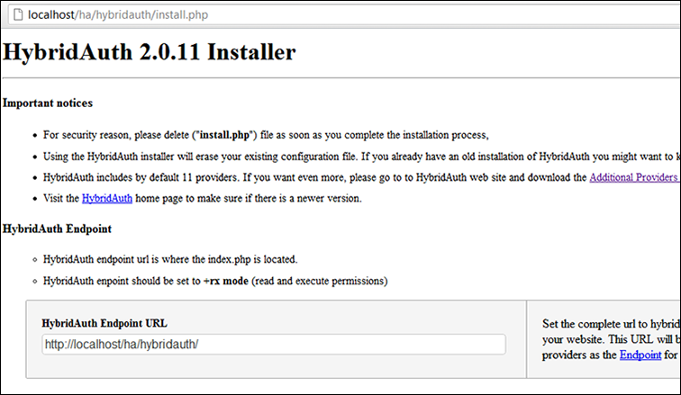
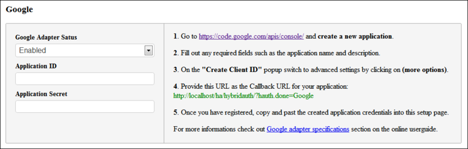
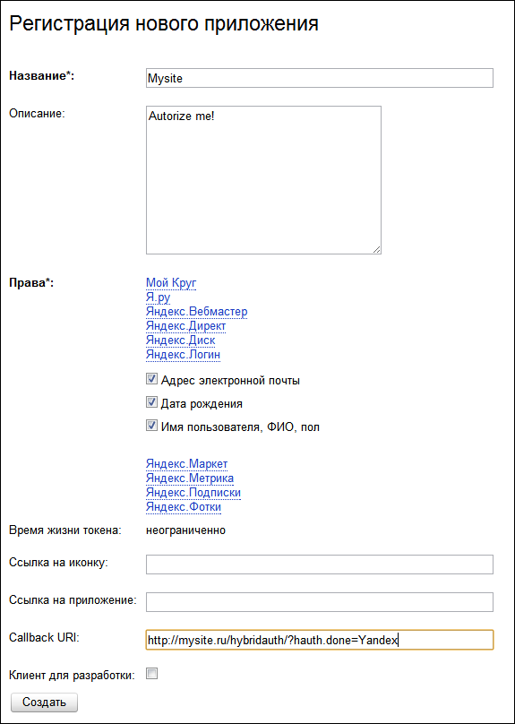
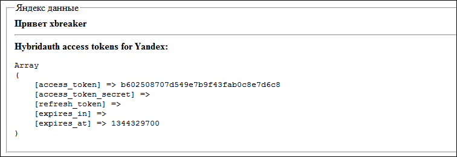

>Это копия моей [оригинальной статьи](https://habr.com/ru/post/149187/), опубликованной на Хабре в 2012 году. Опубликована как есть, без изменений текста, поправлены только ссылки.

#### Введение

На своем сайте на php для авторизации пользователей я в последнее время пользовался сервисом Loginza. Все было очень круто и удобно, но в голове начала зарождаться идея отказа от этого замечательного сервиса и вот почему:

1.  Авторизация пользователей в случае закрытия Loginza или отказа от нее --- в этом случае мы потеряем пользователей, в привязанных профилях которых не указан email;
2.  Дополнительная информация, например, ВКонтакте умеет отдавать фото пользователя в нескольких видах, в том числе квадратный аватар. С Логинзой получить эти данные не представляется возможным, сервис сам решает какие данные запрашивать и какие отдавать;
3.  С момента продажи Яндексу Логинза начала умирать: на запросы пользователей никто не отвечает, сервис не развивается, а находится в том виде, в котором был 1-2 года назад.\
Встал вопрос замены и использовать альтернативные сервисы желания уже не возникало --- никто не представлял возможности «общаться» с соц. сетью напрямую, а расширенные поля профиля обычно включались в платные услуги. Хотелось автономного решения с возможностью гибкой настройки запрашиваемых полей и в итоге я остановился на php библиотеке HybridAuth.

#### HybridAuth

HybridAuth --- библиотека с открытым исходным кодом, которая позволяет использовать авторизацию с использованием OAuth1, OAuth2 и OpenID. В составе библиотеки уже идут настройки для большинства популярных соц. сетей, таких как Google, Facebook, Twitter, и есть даже ВКонтакте. Текущая стабильная версия 2.0.11, версия в разработке 2.1.0 --- ссылки на github есть в конце статьи. Распространяется по лицензиям MIT и GPL, подробнее об этом можно прочитать [здесь](https://hybridauth.github.io/hybridauth/licenses.html).

В состав библиотеки включены примеры использования и набор наиболее популярных сервисов авторизации. Рассмотрим пример авторизации через Twitter, для этого возьмем последнюю стабильную версию и установим ее на локальном сервере. Все примеры находятся в каталоге `examples`, настройки сервисов в `hybridauth/config.php`, там же находится `install.php`, который поможет нам создать файл настроек автоматически, откроем его:

Для начала нам необходимо указать Endpoint URL --- полный путь к корневому каталогу плагина, он используется некоторыми сервисами для возрата на ваш сайт. Далее идут настройки всех сервисов авторизации, а так же инструкции по получению ID и Secret:

Для нашего примера [создадим](https://dev.twitter.com/apps) приложение в Twitter. После этого внесем их в настройки нашей библиотеки и сохраним. Теперь рассмотрим пример авторизации, создадим в корне сайта файл `test.php`:


<?php
session_start();
$config = dirname(__FILE__) . '/hybridauth/config.php';
require_once( "hybridauth/Hybrid/Auth.php" );
if( isset( $_GET["login"] ) ) {
  try  {
    $hybridauth = new Hybrid_Auth( $config );
    $adapter = $hybridauth->authenticate( "twitter" );
    $user_profile = $adapter->getUserProfile();
  } catch( Exception $e )  {
    die( "<b>got an error!</b> " . $e->getMessage() );
  }
}
if( ! isset( $user_profile ) ) {
  ?>
  
Нажмите Войти для авторизации.

  <h2><a href ="test.php?login=1">Войти</a></h2>
  <?php
} else {
  ?>
  <fieldset>
  <legend>twitter данные</legend>
  <b>Привет <?php echo $user_profile->displayName; ?></b>
  

  <b>Hybridauth access tokens for twitter:</b>
  <pre><?php print_r( $adapter->getAccessToken() ); ?></pre>
  </fieldset>
  <?php
}
?>


Рассмотрим, что он делает:

1.  Проверяет GET параметр login, если его нет, то открывает страницу с предложением авторизации;
2.  При переходе по ссылке mysite.ru/twitter.php?login=1 мы запускаем процесс авторизации. Создается экземпляр класса Hybrid_Auth и с помощью метода authenticate передается название сервиса, через который мы хотим авторизоваться;
3.  Открывается Facebook с предложением авторизации, если пользователь дает доступ, то метод getUserProfile вернет нам данные его профиля, иначе мы получим ошибку.\
Все очень просто! Теперь, посмотрим какие именно данные получает `getUserProfile` в случае с Twitter. Для этого откроем каталог `hybridauth/Hybrid/Providers`, где в виде файлов хранятся настройки сервисов авторизации, нам нужен `Twitter.php`. Находим метод `getUserProfile` и видим получаемые данные:


$this->user->profile->identifier  = (property_exists($response,'id'))?$response->id:"";
$this->user->profile->displayName = (property_exists($response,'screen_name'))?$response->screen_name:"";
$this->user->profile->description = (property_exists($response,'description'))?$response->description:"";
$this->user->profile->firstName   = (property_exists($response,'name'))?$response->name:"";
$this->user->profile->photoURL    = (property_exists($response,'profile_image_url'))?$response->profile_image_url:"";
$this->user->profile->profileURL  = (property_exists($response,'screen_name'))?("http://twitter.com/".$response->screen_name):"";
$this->user->profile->webSiteURL  = (property_exists($response,'url'))?$response->url:"";
$this->user->profile->region      = (property_exists($response,'location'))?$response->location:"";


Можно поменять любые данные или добавить свои, так же в этом файле реализованы методы получения контактов профиля и изменения статуса. То есть при необходимости для любой социальной сети можно не только изменить набор необходимых данных, но и дописать свой функционал на основе их API.

#### Яндекс

В качестве примера добавления нового сервиса авторизации, попробуем добавить Яндекс, для этого создадим `hybridauth/Hybrid/Providers/Yandex.php`. Яндекс использует OAuth2 для авторизации, поэтому наш класс будет наследовать его:


class Hybrid_Providers_Yandex extends Hybrid_Provider_Model_OAuth2


Для OAuth1 нужно использовать `Hybrid_Provider_Model_OAuth1`, а для OpenID --- `Hybrid_Provider_Model_OpenID`. Теперь нам необходимо разобраться какие данные нужны Яндексу для авторизации пользователя и доступу к данным его профиля. Сначала создадим приложение Яндекс API, для получения ID и Secret полей --- заходим [сюда](https://oauth.yandex.ru/client/my) и регистрируем новое приложение. Для получения данных профиля будем использовать API Логин.Яндекс, где отметим поля почтового ящика и ФИО пользователя.

Пример заполнения данных

У нас есть необходимые ключи, осталось внести их в настройки HybridAuth, открываем `hybridauth/config.php` и в конец добавляем:


"Yandex" => array ( "enabled" => true, "keys" => array ( "id" => "Id приложения", "secret" => "Пароль приложения" ) ),


Далее читаем [документацию Яндекса](http://api.yandex.ru/oauth/doc/dg/reference/obtain-access-token.xml) и видим, что для авторизации нам необходимо обращаться к `oauth.yandex.ru/authorize`, а для получения токена к `oauth.yandex.ru/token`. Осталось узнать адрес API Логин.Яндекс --- для этого открываем документацию [API](http://api.yandex.ru/) и находим Вход через Яндекс, а там [OAuth + Яндекс.Логин](http://api.yandex.ru/login/). Тут находим, что для получения информации о пользователе нужно обращаться к `login.yandex.ru/info`. Отлично, все необходимое у нас есть, возвращаемся к Yandex.php, в функции initialize указываем ссылки на API:


$this->api->api_base_url  = "https://login.yandex.ru/info";
$this->api->authorize_url = "https://oauth.yandex.ru/authorize";
$this->api->token_url     = "https://oauth.yandex.ru/token";


Так же укажем, что полученный токен необходимо передавать параметром `oauth_token`:


$this->api->sign_token_name = "oauth_token";


Теперь в функции getProfiles напишем разбор данных, для начала сформируем запрос на получения профиля:


$response = $this->api->api( "?format=json" );


Сейчас мы имеем объект $response, который содержит в себе все полученные данные, сохраним их по аналогии с Twitter.php:


$this->user->profile->identifier    = (property_exists($response,'id'))?$response->id:"";
$this->user->profile->firstName     = (property_exists($response,'real_name'))?$response->real_name:"";
$this->user->profile->displayName   = (property_exists($response,'display_name'))?$response->display_name:"";
$this->user->profile->photoURL      = 'http://upics.yandex.net/'. $this->user->profile->identifier .'/normal';
$this->user->profile->gender        = (property_exists($response,'sex'))?$response->sex:"";
$this->user->profile->email         = (property_exists($response,'default_email'))?$response->default_email:"";
$this->user->profile->emailVerified = (property_exists($response,'default_email'))?$response->default_email:"";


В итоге мы получили вот такой файл:

**Yandex.php**

<?php
class Hybrid_Providers_Yandex extends Hybrid_Provider_Model_OAuth2 {
  function initialize() {
    parent::initialize();
    $this->api->api_base_url    = "https://login.yandex.ru/info";
    $this->api->authorize_url   = "https://oauth.yandex.ru/authorize";
    $this->api->token_url       = "https://oauth.yandex.ru/token";
    $this->api->sign_token_name = "oauth_token";
  }
  function getUserProfile() {
    $response = $this->api->api( "?format=json" );
    if ( !isset( $response->id ) ) {
      throw new Exception( "User profile request failed! {$this->providerId} returned an invalide response.", 6 );
    }
    $this->user->profile->identifier    = (property_exists($response,'id'))?$response->id:"";
    $this->user->profile->firstName     = (property_exists($response,'real_name'))?$response->real_name:"";
    $this->user->profile->displayName   = (property_exists($response,'display_name'))?$response->display_name:"";
    $this->user->profile->photoURL      = 'http://upics.yandex.net/'. $this->user->profile->identifier .'/normal';
    $this->user->profile->gender        = (property_exists($response,'sex'))?$response->sex:"";
    $this->user->profile->email         = (property_exists($response,'default_email'))?$response->default_email:"";
    $this->user->profile->emailVerified = (property_exists($response,'default_email'))?$response->default_email:"";
    return $this->user->profile;
  }
}
?>


Изменим наш пример с Twitter на Яндекс:


$adapter = $hybridauth->authenticate( "yandex" );


Пробуем авторизоваться:

И в итоге получаем:

Вот и все, авторизация через Яндекс прошла успешно. Можно заняться подключением остальных сервисов, которые нам необходимы.

Удобное подключение, простое добавление новых сервисов и открытый исходный код --- все то, чего не хватало при работе со сторонними сервисами. Так же, для упрощения интеграции, библиотека имеет плагины к популярным фреймворкам и CMS, таким как Yii, Symfony2, Wordpress, Drupal и [другие](https://hybridauth.github.io/hybridauth/plugins.html).

По поводу ошибок и неточностей, а так же с дополнениями просьба обращаться в личку.

Ссылки по теме:

-   [Страница библиотеки 2.x](https://hybridauth.github.io/hybridauth/)
-   [Страница загрузки библиотеки и плагинов 2.x](https://hybridauth.github.io/hybridauth/plugins.html)
-   [Страница проекта на GitHub](https://github.com/hybridauth/hybridauth)
-   [Мой форк проекта на GitHub](https://github.com/xbreaker/hybridauth)

**upd**: выложил авторизацию для [Яндекса](https://github.com/xbreaker/hybridauth/tree/master/additional-providers/hybridauth-yandex) и [Mail.ru](https://github.com/xbreaker/hybridauth/tree/master/additional-providers/hybridauth-mailru), [Одноклассники](https://github.com/xbreaker/hybridauth/tree/master/additional-providers/hybridauth-odnoklassniki) получились с костылем для совместимости с PHP > 5.3.0.
